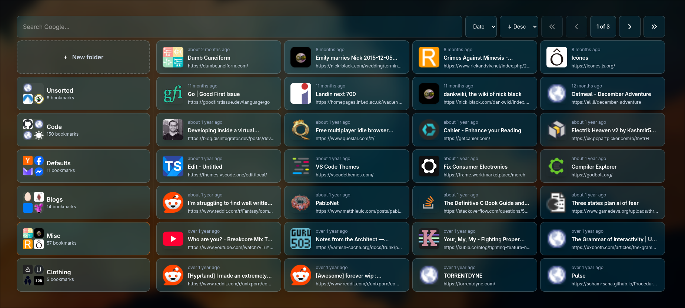

# Portico

Portico is my personal bookmark manager. I really dislike excessive curation, so it offers only barebones functionality. Bookmarks can be organised into folders, that's about it.

The UI is currently implemented as an override of the Chrome new tab page. This ensures they're always front-and-center, increasing the likelihood I'll actual get around to reading them. 

## Components
- a browser extension for saving bookmarks
- a simple Go backend for storing bookmarks in sqlite
- a neat grid-based UI 

## Getting Started

Run `make dev` to boot everything up. 
Run `make deploy` to build

If you're using systemd:
- `mv portico.service.example portico.service`
- set your home directory
- `make install-service`
- `make start-service`. This will run everything in a service. 
- Add the extension to Chrome via `chrome://extensions/` > `load unpacked`.