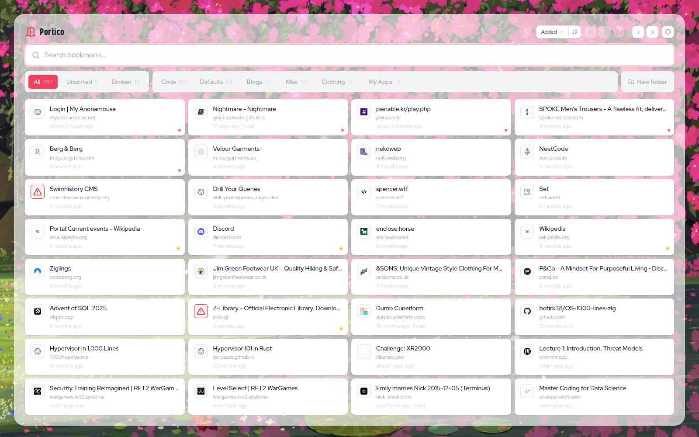

<h1 align="center">Portico</h1>

  

Portico is my personal startpage and bookmark manager.

## Components
- a browser extension for adding/removing bookmarks
- a Go backend for storing bookmarks in sqlite
- a search engine wrapper

## Getting Started

Run `make dev` to boot everything up.
Run `make deploy` to build

If you're using systemd:
- `mv portico.service.example portico.service`
- set your home directory
- `make install-service`
- `make start-service`. This will run everything in a service.
- Add the extension to Chrome via `chrome://extensions/` > `load unpacked`.